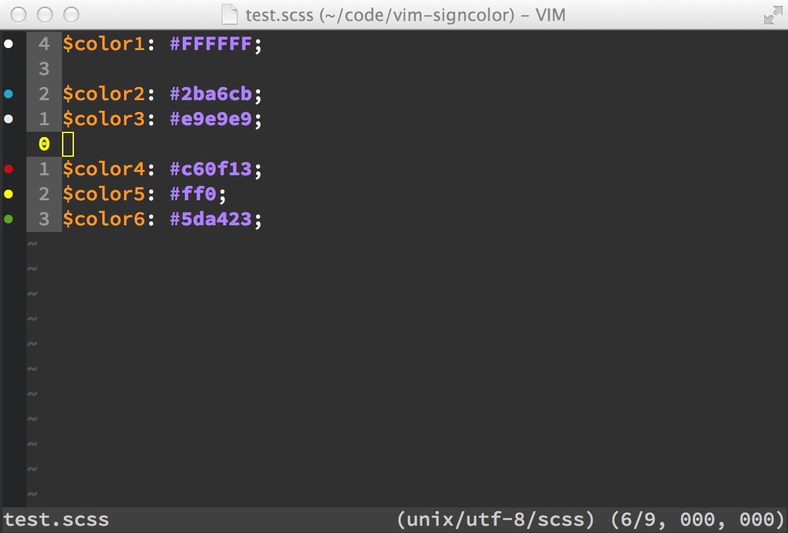

vim-signcolor
=============

Vim plugin to show RBG color values (#FFFFFF or #FFF) from the current buffer in the "signs" column. Designed to be toggled on/off to quickly find and identify color values, primarily in SASS/LESS/CSS files (although it supports any file type).

Requires:

- VIM 7.x with 'signs' support. Recommended only for gVIM or MacVIM



Usage
-----

Bind a key to the `signcolor#toggle_signs_for_colors_in_buffer()` function. The following binds it to `<leader>q` (in my case `,q`)

```vim
nnoremap <silent> <leader>q :call signcolor#toggle_signs_for_colors_in_buffer()<CR>
```

Use said key to toggle (show/unshow) the colored signs.

Issues
------

- Currently doesn't support other color representations (HSL, RBGA()), etc.
- Sign symbol, etc should be configurable

Similar Tools
-------------

- Inspired by [Gutter Colour](https://sublime.wbond.net/packages/Gutter%20Color)
- [vim-css-color](https://github.com/ap/vim-css-color)
- [vim-gitgutter](https://github.com/airblade/vim-gitgutter)
